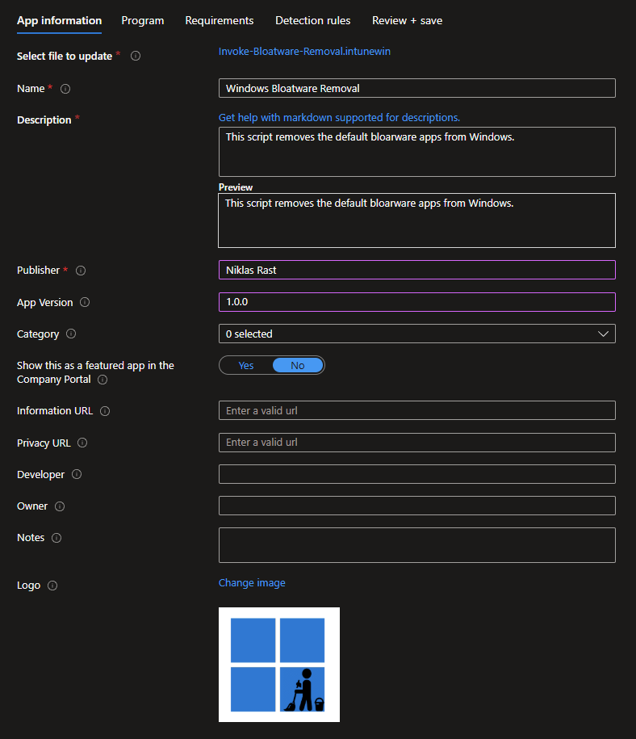
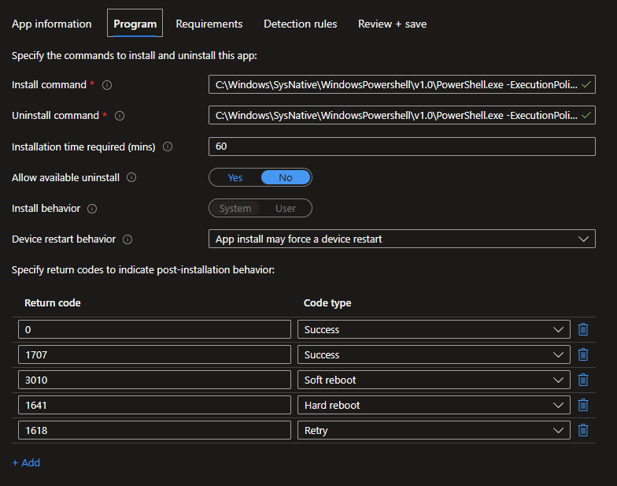
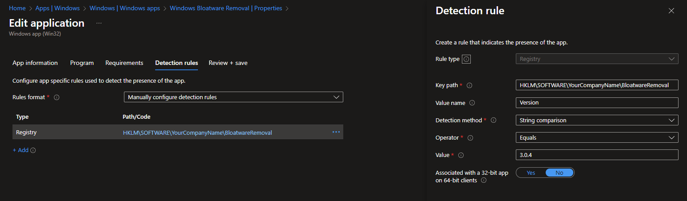

# 🧹 Windows Bloatware removal 🧹

This repo contains an powershell scripts to remove bloatware applications from any Windows 10 or newer installation.

## Customization
Change the company name to match your company name for the detection:
```powershell
$companyName = "YourCompanyNameHere"
```

## Intune Package
Create a `.INTUNEWIN` from the script and upload it as a Intune package:


### Install:
```powershell
C:\Windows\SysNative\WindowsPowershell\v1.0\PowerShell.exe -ExecutionPolicy Bypass -Command .\Invoke-Bloatware-Removal.ps1
```

### Uninstall
There is no "Uninstall as the apps are removed and I did not intent to reinstall them, so I used the same as the Install ;)



### Detection
Build the Intune detection on the Registry key: HKLM\Software\$companyName\BloatwareRemoval and check the value Version to match the set version number from the script that you selected for install



## Bloatware list:
If you need more apps simply add them to the $bloatwareApps list:
```powershell
$bloatwareApps = @(
    .
    .
    .
)
```
 
## Logfiles:
The scripts create a logfile with the name of the .ps1 script in the folder C:\ProgramData\Microsoft\IntuneManagementExtension\Logs.

## 🤝 Contributing

Before making your first contribution please see the following guidelines:
1. [Semantic Commit Messages](https://gist.github.com/joshbuchea/6f47e86d2510bce28f8e7f42ae84c716)
2. [Git Tutorials](https://www.youtube.com/playlist?list=PLu-nSsOS6FRIg52MWrd7C_qSnQp3ZoHwW)

Made with ❤️ by [Niklas Rast](https://github.com/niklasrst)
